<!-- Typing animation header -->

 

---

### 🚀 About Me

- 🎯 **DSA Enthusiast** — sharpening problem solving with C++, daily grinding on LeetCode, HackerRank & GeeksforGeeks
- 🤖 Currently learning **AI / Machine Learning**
- 🌐 Also exploring **Full Stack Development (FSD)**
- 🔭 Currently building **[Project-AI](https://github.com/SumitKumarSingh17/Project-AI)**
- 💬 Ask me about **DSA, C++, Python, and ML basics**
- 📫 Reach me at **sumitkrsingh885@gmail.com**
- ⚡ Fun fact: I believe consistency beats intensity

---

### 🛠️ Languages & Tools

**Programming Languages**

  

**Databases**

  

**AI / ML Libraries**

  

**Tools & Platforms**

---

### 📊 GitHub Stats

 

 

---

### 📈 Daily Coding Activity

**LeetCode Heatmap (past 52 weeks)**

  

**GeeksforGeeks Stats**

---

### 🏆 GitHub Trophies

---

### 📌 Featured Project

---

### 🌐 Connect With Me

  

**Coding Profiles**

 

---

⭐️ *From [SumitKumarSingh17](https://github.com/SumitKumarSingh17)*

